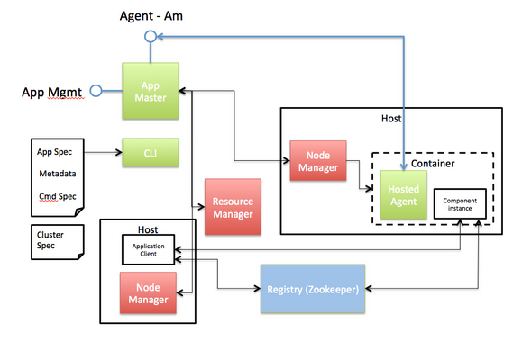
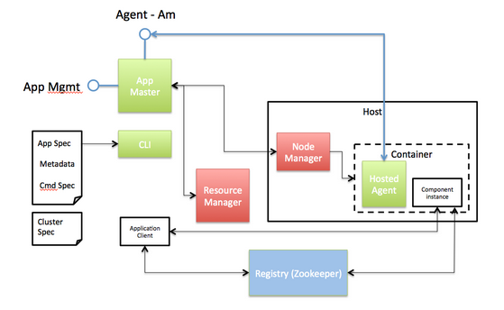

<!---
   Licensed to the Apache Software Foundation (ASF) under one or more
   contributor license agreements.  See the NOTICE file distributed with
   this work for additional information regarding copyright ownership.
   The ASF licenses this file to You under the Apache License, Version 2.0
   (the "License"); you may not use this file except in compliance with
   the License.  You may obtain a copy of the License at

       http://www.apache.org/licenses/LICENSE-2.0

   Unless required by applicable law or agreed to in writing, software
   distributed under the License is distributed on an "AS IS" BASIS,
   WITHOUT WARRANTIES OR CONDITIONS OF ANY KIND, either express or implied.
   See the License for the specific language governing permissions and
   limitations under the License.
-->

# Guidelines for Clients and Client Applications

This document will define the canonical scenarios for the deployment and management of Slider hosted applications.  It will define the types of applications supported, the sequence of events for deploying the application types, and the management facilities exposed for the deployed applications.

## Deployable Application Types

The server-side components of an application (alternatively referred to as the application components) will be deployed and managed using a fairly uniform mechanism.  However, applications can be distinguished by their associated client implementation.  Specifically, each different client application type can yield different development, deployment, and management approaches.  There are two primary application client types:

1. **New application client** - the application deployed to Slider will interact with a newly coded application client leveraging the Slider supplied client API and management facilities.  The client API will make use of distributed management facilities such as Zookeeper to provide the application client with the configuration information required for invoking remote application components.  For example, the application client (or an application hosted component, e.g. a web application) will leverage the API to lookup the appropriate host(s) and port(s) for RPC based communication.  Alternatively, if annotation libraries or an "app container" environment is provided, the appropriate values will be injected into the client process.

2. **Existing, configurable client** - the application client predates deployment in the Slider environment, but is implemented in a manner that can be integrated with the Slider application client support facilities (APIs etc).  This case is probably very similar in nature to the new application client in terms of the mechanisms it will use for component discovery, but is distinguished by the fact that it’s development pre-dates Slider.  There are two possible variants of application client in this category:

 1. A client that is static - the client is dependent on existing configuration properties to communicate with master components and the existing code can not been altered (at least in the short term).  This type of client would require a support infrastructure that may be relatively complex (e.g. templating of configuration files, proxying of server components).

 2. A client that can be enhanced - a client that can have its code altered can leverage a number of mechanisms (REST APIs, Zookeeper, a provided client discover API) to obtain the information required to invoke the master components of the application.

## Deployment Scenarios

There are two primary deployment mechanisms to examine:  application component and client-side (application client) component deployment.

## Application Component Deployment

Applications generally are composed of one or more components.  In the deployment steps below, be advised that there may be a need to repeat some of the configuration/definition steps for each component.

The process of deploying applications (specifically, the non-client components of an application) is:

1. Compose an application package that contains:

   1. An application definition that provides the following items:

      1. name and version of application

      2. component type(s) and role(s)

      3. system requirements (RAM, CPUs, disk space etc)

      4. ports required for RPC, UI

      5. software dependencies (HDP deployed services required in the cluster, JDK versions, python versions, etc)

      6. configurable properties including:

         1. application-specific properties.  If the properties designate port numbers, the general recommendation would be to set them to zero to allow for the system to assign a dynamically selected port number that subsequently can be published to zookeeper.  Other properties designating remote components running on other hosts may need some additional support (floating IPs, discovery APIs, etc).  The processing of these properties by the infrastructure requires agreed upon mechanisms for identification (e.g. all properties beginning with the application name are passed through as application properties with the application name prefix stripped)

         2. Slider-specific properties.  The following Slider properties are currently available:

            1. yarn.memory

            2. Environment variables specified with a "env." prefix (e.g. env.MALLOC_ARENA_MAX)

            3. role.instances

            4. role.name

            5. yarn.vcores

   2. Other application artifacts (binaries etc)

2. Install the application

   1. The application package will be made available in a designated HDFS location

   2. If there is a managed application client component it will be deployed to selected nodes as defined in the cluster specification.

   3. Slider interacts with yarn (resource manager and node manager(s)) to populate the local resources on the designated nodes.

   4. Some properties important for facilitating remote interaction with the deployed components are advertised via zookeeper (though this may actually take place during component start up as the assignment of ports is a late-binding operation.  Alternatively, developers may be encouraged to store these values in a registry rather than as direct-application configuration properties).

## Client Application Deployment

Although application clients are components that are deployed using mechanisms similar to other application components (especially in the managed case), there are a number of features that distinguish them:

1. **configuration** - client applications generally require some information (host names, ports, etc) to ascertain the correct networking values required to communicate with the application's server components.  In order to work in a yarn deployment, this configuration may need to be manipulated to allow proper operation (e.g. the configuration files updated with correct values, the configuration properties ascertained dynamically from services such as Zookeeper)

2. **execution context **- it may be necessary to provide an execution environment for application clients that allows for discovery mechanisms (dependency injection, annotation libraries, etc)

For each of these application client types there are two possible deployment modes:

* **Managed** - the application client is deployed via Slider mechanisms.  Clients, in this context, differ from the other application components in that they are not running, daemon processes.  However, in a managed environment there is the expectation that the appropriate binaries and application elements will be distributed to the designated client hosts, and the configuration on those hosts will be updated to allow for execution of requests to the application’s master/server components.  Therefore, client components should be defined in the application specification as elements that the management infrastructure supports (Figure 1).

Figure 1 - Managed Application Client and associated Slider Application

* **Unmanaged** - the application client is run as a process outside of Slider/yarn, although it may leverage Slider provided libraries that allow for server component discovery etc (Figure 2).  These libraries would primarily be client bindings providing access to the registry leveraged by Slider (e.g. Java and python bindings to Zookeeper)

Figure 2 - Unmanaged Application Client and associated Slider Application

### Managed Application Client

A managed application client is a component defined as part of the Slider/yarn application (i.e. it is part of the application definition presented to Slider).  As such, it is deployed and managed via standard Slider/yarn mechanisms.  This type of application client is more than likely already configured and written to work in a yarn environment.

There are two primary needs to be met for a properly functioning client:

1. **Discovery** - as a client, it is important that the client application retrieve the information it requires in order to communicate with the remote application components.  As application components are spawned they (or the associated container agent) will advertise the relevant information using zookeeper.  It will be up to the client (or the associated Slider client library) to contact zookeeper and retrieve the requested information.

2. **Configuration** - there may be use cases in which a large number of configuration items are required by the client for its processing.  In such cases it is more appropriate for a client to perform a bulk download of the application component(s) configuration as a JSON or XML document (via zookeeper or Slider-app comm?)

Whether ascertained via discovery or bulk configuration retrieval, the attributes that the client obtains will more than likely need to be populated into the client’s configuration files.  Therefore, a templating facility or the like should be provided to allow for such configuration file manipulation.

### Unmanaged Application Client

An unmanaged application client is a standalone application that leverages application components deployed into the Slider/yarn environment.  It is not possible to predict the deployment mechanisms or network topology employed for an unmanaged application.  However, it is feasible to provide some guidance and/or software (APIs etc) to allow for application component discovery and communication.

## Application Management

Post deployment, the Slider infrastructure will provide the requisite set of administrative facilities required for application management, including the ability to start/stop the application, monitor the application, and reconfigure the application. 

### General Management

There is one general management command:

* List Yarn Apps - returns a listing of deployed yarn apps and associated information:

 * name and version

 * dependencies (required HDP services and versions, etc)

 * configuration properties

 * components/roles and associated configuration

### Application/Component Management

The following administrative functions are supported for applications:

* Install the application - the installation command will take care of the population of the application resources into the pre-determined application resource directory in HDFS.  The required configuration and binary directories will also be created.

* start/thaw the application - Slider/Yarn runtime negotiates and instantiates the number of component containers designated by the cluster description and the components are started.

* stop/freeze the application - similar to stopping, applicaiton (or a subset of their components) can be stopped.

* get application status - the retrieval of application status may take a number of forms, including:

 * liveness of service components

 * operational metrics (application-level or component-level)

 * viewing of logs

* get application configuration - the configuration of application components is retrieved (JSON or XML form)

* get cluster configuration - the cluster configuration is retrieved (number of various application components, associated hosts etc)

* get cluster history

* re-configure cluster

